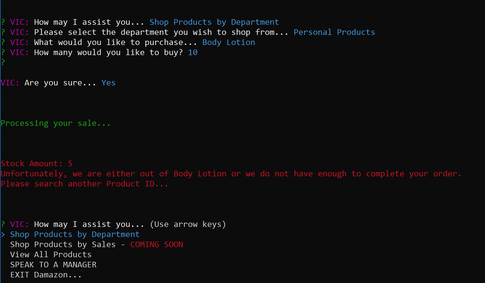

# DAMAZON

version 1.0
Video Demo:
https://drive.google.com/file/d/1DsE0EwRi--HxGP0N_AuJzCpqtltB-F1Z/view

The world's smallest and longest gif

## NPM Packages Used
- inquirer
- mysql
- cli-table
- chalk

Overall, I really thought about User Interface with this assignment. I took the opportunity to think of as many small details needed to create a streamline process.

### CUSTOMER TERMINAL
"node damazonCustomer.js" - *no quotes to initialize*

The user is greeted by V.I.C. (virtual interactive clerk) and given several options as to how they would like to search for products.

#### Choices Available:
1. Shop Products by Department
2. Shop Products by Sales (mock up)
3. View All Products
4. SPEAK TO A MANAGER (just something silly but functional)
5. Exit Damazon

There are also CHECKS in place to make sure Users can't buy a product that is out of stock.

### MANAGER TERMINAL
"node damazonManager.js"

A mock up for a Manager's Terminal that allows them to create new products and interact with a portion of Damazon not accessible by Customers.

#### Choices Available:
1. View all products(ANNOTATES LOW STOCK products and OUT OF STOCK products)
2. Restock Inventory
3. Add a new product to the store(forces the Manager to choose department name from current department names)
4. Exit the Terminal

### SUPERVISOR TERMINAL
"node damazonSupervisor.js"

A mock up for the Supervisor Terminal that allows a Supervisor to create a new department.

#### Choices Available:
1. View all profits
2. Create new department
3. Create new sale...(mock up, that could update all products in a specific department with a percentage)
4. Exit the Terminal
